# 模糊控制器

## 1. 模糊集合

### 模糊集合的定义

定义**论域**是变量可能的取值范围，比如分数的论域是 $[0,100]$。

用自然语言描述一个变量时，一般不会用属于/不属于之类的语言去描述一个变量，而是用一种模糊的语言去对变量进行描述。比如分数为 $[90,100]$ 时称为 "优秀"。对该变量的模糊描述称为**模糊集合**，用**隶属度函数**进行描述。
$$
A = \mu_1/x_1 = 
\begin{cases}
0, x_1\notin A \\
\mu_1(x_1), x_1属于A的程度 \\
1, x_1\in A
\end{cases}
$$
$x_1$ 是论域中的元素，$\mu_1(x_1)$ 为 $x_1$ 的隶属度函数，$x_1$ 取具体值时，可以根据上面的计算方式给出具体的隶属度函数。

一个语言值对应一个模糊集合。注意有多种语言评价的模糊集合，比如分数的"优秀"，"良好"，"及格"，"不及格"是四种模糊集合。

在论域中，模糊集合可以表示为：

> - **离散元素集合：**
>   $$
>   A = \mu_1/x_1+\mu_2/x_2 + \cdots 
>   $$
>   或：
>   $$
>   A =\{(x_1,\mu_1(x_1)),(x_2,\mu_1(x_2)),\cdots\}
>   $$
>
> - **连续元素集合：**
>   $$
>   A = \int\mu_A(x)/x
>   $$
>
> /，+，$\int$ 不是数学意义的符号，是表征模糊集合的"构成"和"属于"。

---

**例1.** 定义论域为 $X = \{1,2,3,4,5\}$，评价为 "是否接近3"，定义其模糊集合。

论域是离散的，模糊集合：
$$
A = 0/1+0.5/2+1/3+0.5/4+0/5
$$

---

**例2.** 定义论域为年龄：$X \in [0,100]$，评价为 "年轻"。论域是连续的，定义其模糊集合为：
$$
A = 
\begin{cases}
1, 0 ≤ x ≤ 25 \\
[1-(\frac{x-25}{5})^2]^{-1}, 25<x<100
\end{cases}
$$

---

实际上，**一个模糊集合代表的是一个隶属度函数**。

### 模糊集合的运算

模糊集合和隶属度函数是对应的，因此两个子集之间的运算是逐点对隶属度函数进行计算。

> 1. 空集：模糊集合的空集的隶属度为 0。论域中的任何元素不属于这个集合。
> 2. 全集：模糊集合的全集的隶属度为 1。论域中的任何元素都属于这个集合。
> 3. 等集：对论域所有元素 $x$，模糊集合 $A$ 和 $B$ 的隶属度函数相等，则模糊集合 $A$ 和 $B$ 相等。
> 4. 补集：$A$ 的隶属度函数为 $\mu_A$，则 $\overline{A}$ 的隶属度函数为 $1-\mu_A$。
> 5. 子集：$B \subseteq A$ 等价于 $\mu_B ≤ \mu_A$。
> 6. 并集：$C = A \cup B$，其中一种隶属度函数定义为 $\mu_C = \max\{\mu_A,\mu_B\} = \mu_A \lor \mu_B$。
>
>    并集可以理解为：一个人的"身高"的"高"的隶属度是 0.9，"体重"的"重"的隶属度是 0.1；则其"高或重"的隶属度应当是 0.9。
> 7. 交集：$C = A \cap B$，其中一种隶属度函数定义为 $\mu_C = \min\{\mu_A,\mu_b\} = \mu_A \land \mu_B$。
>
>    并集可以理解为：一个人的"身高"的"高"的隶属度是 0.9，"体重"的"重"的隶属度是 0.1；则其"高且重"的隶属度应当是 0.1。

模糊运算有以下性质，注意一般互补律不成立($\mu_A \lor \mu_\overline{A} ≠ 1$)。

| 名称      | 运算法则                                                     |
| :-------- | :----------------------------------------------------------- |
| 1. 幂等律 | $A \cup A = A, A \cap A = A$                                 |
| 2. 交换律 | $A \cup B = B \cup A, A \cap B = B \cap A$                   |
| 3. 结合律 | $(A \cup B) \cup C = A \cup (B \cup C)$ $(A \cap B) \cap C = A \cap (B \cap C)$ |
| 4. 吸收律 | $A \cup (A \cap B) = A$ $A \cap (A \cup B) = A$           |
| 5. 分配律 | $A \cup (B \cap C) = (A \cup B) \cap (A \cup C)$ $A \cap (B \cup C) = (A \cap B) \cup (A \cap C)$ |
| 6. 复原律 | $\overline{\overline{A}} = A$                                |
| 7. 对偶律 | $\overline{A \cup B} = \overline{A} \cap \overline{B}$ $\overline{A \cap B} = \overline{A} \cup \overline{B}$ |
| 8. 两极律 | $A \cup E = E, A \cap E = A$ $A \cup \varnothing = A, A \cap \varnothing = \varnothing$ |

模糊集合的逻辑运算是隶属函数的运算过程，通常使用 $\max,\min$ 运算进行模糊集合的交并运算，但是仍然有一些其他的方法。

> - **交运算算子：**
>
>   1. 模糊交算子：$\mu_C = \min\{\mu_A,\mu_B\}$；
>   2. 代数积算子：$\mu_C = \mu_A \cdot \mu_B$；
>   3. 有界积算子：$\mu_C = \max\{0, \mu_A+\mu_B-1\}$；
>
> - **并运算算子：**
>
>   1. 模糊并算子：$\mu_C = \max\{\mu_A,\mu_B\}$；
>   2. 代数和算子：$\mu_C = \mu_A + \mu_B - \mu_A \cdot \mu_B$；
>   3. 有界和算子：$\mu_C = \min\{1, \mu_A+\mu_B\}$；
>
> - **平衡算子** - 用于补偿 $\max,\min$ 运算时丢失的信息：
>   $$
>   \mu_C = [\mu_A\mu_B]^{1-\gamma}[1-(1-\mu_A)(1-\mu_B)]^\gamma
>   $$

### 隶属度函数

隶属度函数的值域是 $[0,1]$。通常使用以下的隶属度函数：

1. 高斯隶属度函数：
   $$
   f(x;\sigma,c) = e^{-\frac{(x-c)^2}{2\sigma^2}}
   $$
   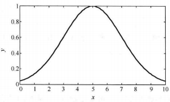

2. 广义钟形隶属函数
   $$
   f(x;a,b,c) = \frac{1}{1+|\frac{x-c}{a}|^{2b}}
   $$
   

   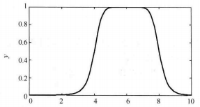

3. S形隶属函数 - 表示正大/负大
   $$
   f(x;a,c) = \frac{1}{1+e^{-a(x-c)}}
   $$
   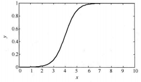

4. 梯形隶属函数
   $$
   f(x;a,b,c,d)=
   \begin{cases}
   0, x≤a \\
   \frac{x-a}{b-a}, a≤x≤b \\
   1, b≤x≤c \\
   \frac{d-x}{d-x},c≤x≤d \\
   0,x≥c
   \end{cases}
   $$
   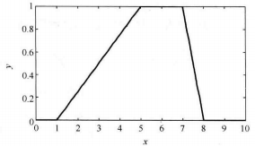

5. 三角形隶属函数
   $$
   f(x;a,b,c)=
   \begin{cases}
   0, x≤a \\
   \frac{x-a}{b-a}, a≤x≤b \\
   \frac{c-x}{c-b}, b≤x≤c \\
   0, x≥c
   \end{cases}
   $$
   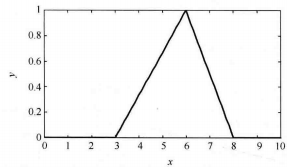

### 模糊关系和运算

对于论域 $X$ 和论域 $Y$，其隶属度可以组成一个矩阵，称为模糊矩阵 $R$。模糊矩阵的每一个元素指的是元素 $x$ 和元素 $y$ 对于评价的隶属度，每一个元素必须在 $[0,1]$ 内取值。比如子女和父母的长相相似度可以组成一个 $2 × 2$ 矩阵，每个元素表示相似度。

模糊矩阵有以下运算方式：

> 1. 相等：如果 $a_{ij} = b_{ij}$，则 $A = B$；
> 2. 包含：如果 $a_{ij} ≤ b_{ij}$，则 $A \subseteq B$；
> 3. 并运算：$c_{ij} = a_{ij} \lor b_{ij}$，则 $C = A ∪ B$；
> 4. 交运算：$c_{ij} = a_{ij} \land b_{ij}$，则 $C = A ∩ B$；
> 5. 补：$c_{ij} = 1-a_{ij}$，则 $C = \overline{A}$；

定义 $X × Y$ 的一个模糊子集为 $X$ 到 $Y$ 的一个模糊关系。

---

两个模糊关系可以合成一个新的模糊关系，比如子女和父母的相似度与父母和祖父母的相似度可以合成子女和祖父母的相似度。

记 $R$ 为 $U \times V$ 的模糊关系，$S$ 为 $V \times W$ 的模糊关系，则 $R \circ S$ 为 $U \times W$ 的模糊关系。其隶属度函数为：
$$
\mu_{R\circ S}(u,w) = \lor_{v\in V}\{\mu_R(u,v)\land\mu_S(v,w)\}
$$
可以当作矩阵运算，乘法改为 $\land$，加法改为 $\lor$。

### 模糊推理

通常使用 If A and B then C 语句进行模糊控制。

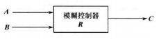

$A$，$B$，$C$ 为模糊集合。$A$ 为误差信号模糊子集，$B$ 为误差变化率的模糊子集，$C$ 是输出的模糊子集。

常用的模糊推理有 Zadeh 方法和 Mamdani 方法，其中 Mamdani 方法是最普通的方法。根据该方法，关系矩阵为：
$$
R = (A\times B)^{T1}\circ C
$$
$(A\times B)^{T1}$ 为模糊关系矩阵 $(A\times B)_{m\times n}$ 构成的 $m\times n$ 列向量，$n$ 和 $m$ 为 $A$ 和 $B$ 论域元素的个数，$T1$ 为列向量转换。

根据模糊关系 $R$ 可以得到给定输入 $A$ 和 $B$ 的对应输出 $C$：
$$
C = (A\times B)^{T2}\circ R
$$
$(A\times B)^{T2}$ 为模糊关系矩阵 $(A\times B)_{m\times n}$ 构成的 $m\times n$ 行向量，$n$ 和 $m$ 为 $A$ 和 $B$ 论域元素的个数，$T2$ 为行向量转换。

---

**例1.**论域 $X = \{a_1,a_2,a_3\}$，$Y = \{b_1,b_2,b_3\}$，$Z=\{c_1,c_2,c_3\}$。已知 $A = 0.5/a_1+1/a_2+0.1/a_3$，$B=0.1/b_1+1/b_2+0.6/b_3$，$C=0.4/c_1+1/c_2$。确定模糊关系 $R$ 并求 $A_1 = 1/a_1+0.5/a_2+0.1/a_3$，$B_1 = 0.1/b_1+0.5/b_2+1/b_3$ 的输出 $C_1$。

$A \times B$ = $A^T \land B$ = $[\begin{matrix}0.5 \\ 1 \\ 0.1\end{matrix}] \land [\begin{matrix}0.1 & 1 & 0.6\end{matrix}]$ = $[\begin{matrix}0.1 & 0.5 & 0.5 \\ 0.1 & 1 & 0.6 \\ 0.1 & 0.1 & 0.1\end{matrix}]$；

$(A \times B)^{T1} = [\begin{matrix}0.1 & 0.5 & 0.5 & 0.1 & 1 & 0.6 & 0.1 & 0.1 & 0.1\end{matrix}]^T$

 $R = (A \times B)^{T1} = [\begin{matrix}0.1 & 0.5 & 0.5 & 0.1 & 1 & 0.6 & 0.1 & 0.1 & 0.1\end{matrix}]^T \circ [\begin{matrix}0.4 & 1\end{matrix}] = [\begin{matrix}0.1 & 0.4 & 0.4 & 0.1 & 0.4 & 0.4 & 0.1 & 0.1 & 0.1 \\ 0.1 & 0.5 & 0.5 & 0.1 & 1 &0.6 &0.1 & 0.1 & 0.1\end{matrix}]^T$

$A_1 \times B_1$ = $A_1^T \land B_1$ = $[\begin{matrix}1 \\ 0.5 \\ 0.1\end{matrix}] \land [\begin{matrix}0.1 & 0.5 & 1\end{matrix}]$ = $[\begin{matrix}0.1 & 0.5 & 1 \\ 0.1 & 0.5 & 0.5 \\ 0.1 & 0.1 & 0.1\end{matrix}]$；

$(A_1 \times B_1)^{T2} = [\begin{matrix}0.1 & 0.5 & 1 & 0.1 & 0.5 & 0.5 & 0.1 & 0.1 & 0.1\end{matrix}]$

$C_1 = (A_1 \times B_1)^{T2} \circ R = [\begin{matrix}0.1 & 0.5 & 1 & 0.1 & 0.5 & 0.5 & 0.1 & 0.1 & 0.1\end{matrix}] \circ [\begin{matrix}0.1 & 0.4 & 0.4 & 0.1 & 0.4 & 0.4 & 0.1 & 0.1 & 0.1 \\ 0.1 & 0.5 & 0.5 & 0.1 & 1 &0.6 &0.1 & 0.1 & 0.1\end{matrix}]^T = [\begin{matrix}0.4 & 0.5\end{matrix}]$

则 $C_1 = 0.4/c_1 + 0.5/c_2$。

## 2. 模糊控制器

### 模糊控制器简介

模糊控制器的原理是：计算机得到被控制量的精确值，然后得到误差信号作为控制器输入，随后对输入进行模糊化作为模糊量，误差的模糊量用相应的模糊语言表示，从而得到误差的模糊向量 $e$；通过模糊向量和给定的模糊关系进行模糊推理得到模糊输出 $u$。
$$
u = e \circ R
$$
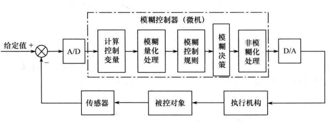

模糊控制器分为单变量模糊控制器和多变量模糊控制器，单变量模糊控制器有以下几种：

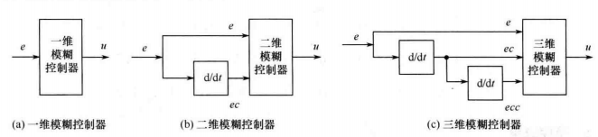

> - 一维模糊控制器：输入变量为误差 $e$，一般一维控制器的动态性能不会太好，常用于控制简单对象；
> - 二维模糊控制器：输入变量为误差 $e$ 及其变化率 $e_c$，其动态性能较好，是常用的控制器；
> - 三维模糊控制器：输入变量为误差 $e$，误差变化率 $e_c$ 和误差变化率的变化率 $e_{cc}$，控制器结构较为复杂，很少使用。

多变量模糊控制器设计困难，通常解耦为很多个多输入单输出模糊控制器以使用单变量模糊控制器的设计方法设计。

模糊控制器的组成如下：

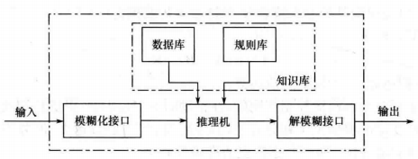

---

模糊化接口:

模糊化接口用于将误差 $e$ 进行模糊化，通常划分为以下模糊子集：

> - $e$ 划分为负大 NB，负小 NS，零 ZO，正小 PS，正大 PB；
> - $e$ 划分为负大 NB，负中 NM，负小 NS，零 ZO，正小 PS，正中 PM，正大 PB；

如果使用三角形隶属度函数，则模糊子集划分如下：

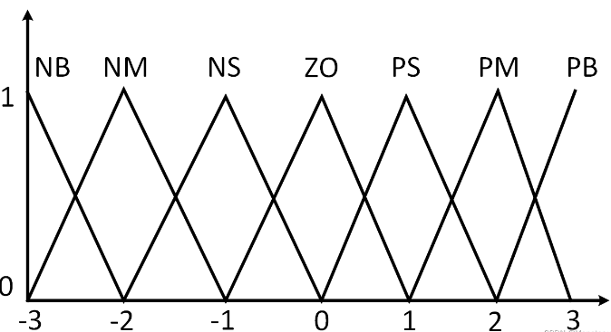

一个具体的输入，可以分别得到这个输入对应的隶属度函数值，比如对于上述隶属度函数组，输入为 1.5 时，隶属度分别为 PS(0.5)，PM(0.5)。

---

知识库:

知识库由数据库和规则库两部分构成。数据库存放的是隶属度函数/论域离散化后的对应值的集合，在规则推理的模糊关系求解方程求解时，向推理机提供数据。

规则库是基于专家知识积累的经验得到的推理表。比如对于误差，其中一个规则为：

IF E is NB then U is PB.

根据规则推导得到模糊关系，则可以直接求解输出：
$$
u = e \circ R
$$
规则库用于存放全部模糊控制规则，与模糊子集划分有关。

规则推导模糊关系的方法如下：

对于 IF E is NB then U is PB 规则，这个规则对应的模糊关系为 $NBe \times PBu$。$NBe$ 和 $NBu$ 为该条规则对应的模糊向量。规则内的模糊集运算取交集。多条规则时，规则间的模糊集运算为并集，运算后可以得到模糊关系 $R$。(实质上是 $(A \times B) \circ C$ 来得到 $R$)

一般的，为减小运算量，对于一个具体的输入，首先查看其激活了哪些规则（隶属度不为 0），然后通过与运算计算规则前提的隶属度（通常取模糊交运算或者代数积运算）；随后与输出规则进行与运算（通常取模糊交运算）；随后将不同的规则输出进行并运算（通常取模糊并运算）得到总输出的隶属度。两个与运算和一个并运算可以取不同的运算算子。一般取模糊算子即可。

---

推理和解模糊:

推理是根据输入模糊量，由模糊控制规则完成模糊推理来求解模糊关系方程，并获得模糊控制量的功能部分。

得到的模糊控制量需要通过解模糊得到清晰的控制量输出，这个过程称为去模糊化，去模糊化有以下方法：

> 1. 加权平均法：
>    $$
>    u = \frac{\sum u_ik_i}{k_i}
>    $$
>    $k_i$ 为自定义系数，$u_i$ 为模糊输出的不同值。
>
> 2. 最大隶属度法：
>    $$
>    u = \frac{1}{N}\sum u_i,u_i = \max(\mu_u(u))
>    $$
>    取所有最大隶属度输出的平均值。
>
> 3. 重心法
>    $$
>    u = \frac{\int u\mu_u(u)du}{\int \mu_u(u)du}
>    $$
>    取隶属度函数曲线与横坐标围成的面积重心作为输出值。
>
>    加权平均法中，$k_i$ 为隶属度时为重心法。

### 模糊控制器实例

以洗衣机洗涤时间的模糊控制器设计为例，控制器输入为衣物的污泥和油脂，输出为洗涤时间。

1. 输入，输出论域设定

   污泥分为三个模糊集：SD(少泥)，MD(中泥)，LD(多泥)

   油脂分为三个模糊集：NG(少油)，MG(中油)，LG(多油)

   洗涤时间分为五个模糊集：VS(很短)，S(短)，M(中等)，L(长)，VL(很长)；

   污泥论域为 $x \in [0,100]$，油脂论域为 $y\in[0,100]$，洗涤时间论域为 $z\in[0,60]$。

   使用三角形隶属度函数：

   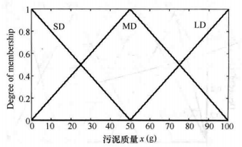

   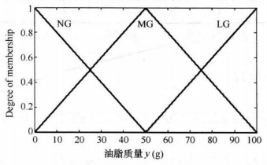

   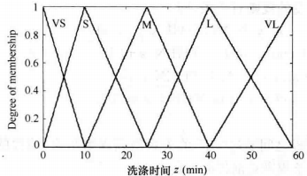

2. 建立模糊控制规则

   根据经验建立规则如下：

   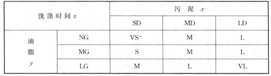

3. 模糊推理，假设当前得到的信息为 $x=60,y=70$；

   隶属度为 $SD(0),MD(0.8),LD(0.2)$；$NG(0),MG(0.6),LG(0.4)$；

   随后进行规则匹配，根据隶属度函数不为零的模糊子集进行规则触发，一共触发了四条规则：

   IF x is MD and y is MG then z is M；

   IF x is MD and y is LG then z is L；

   IF x is LD and y is MG then z is L；

   IF x is LD and y is LG then z is VL；

   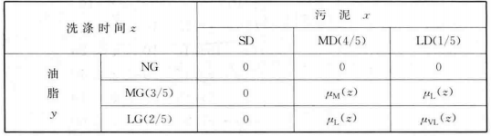

   触发规则后，同一条规则内，前提间通过与运算得到规则结论。本处与运算选择取小运算。则计算的到的规则前提隶属度为 $(MD,MG)(0.6),(MD,LG)(0.4),(LD,MG)(0.2),(LD,LG)(0.2)$;

   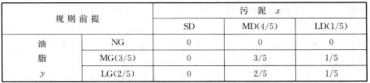
   
   两表进行与运算可以得到规则输出，本处与运算选择取小运算，则模糊规则的隶属度如下：
   
   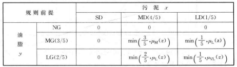
   
   模糊系统的输出隶属度为各条规则隶属度的并集，本处并运算选择取大运算。
   $$
   \begin{aligned}
   \mu_{\text{agg}}(z) &= \max\left\{ \min\left(\frac{3}{5}, \mu_M(z)\right), \min\left(\frac{2}{5}, \mu_L(z)\right), \min\left(\frac{1}{5}, \mu_L(z)\right), \min\left(\frac{1}{5}, \mu_{VL}(z)\right) \right\} \\
   &= \max\left\{ \min\left(\frac{3}{5}, \mu_M(z)\right), \min\left(\frac{2}{5}, \mu_L(z)\right), \min\left(\frac{1}{5}, \mu_{VL}(z)\right) \right\}
   \end{aligned}
   $$
   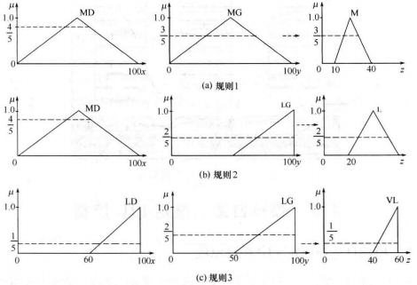
   
   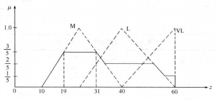
   
   最后，采用最大隶属度平均法，得到精确输出为 $z^* = \frac{19+31}{2} = 25$。

### 模糊 PID 控制器

模糊控制可以用在 PID 控制器中：

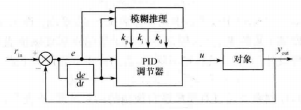

一般取以下规则：

- $K_P$ 规则：

  调节初期应适当取较大的 $K_P$ 值以提高响应速度，而在调节中期，$K_P$ 则取较小值，以使系统具有较小的超调并保证一定的响应速度；而在调节过程后期再将 $K_P$ 值调到较大值来减小静差，提高控制精度。

  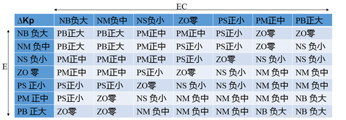

- $K_I$ 规则：

  在调节过程的初期，为防止积分饱和，其积分作用应当弱一些，甚至可以取零；而在调节中期，为了避免影响稳定性，其积分作用应该比较适中；最后在过程的后期，则应增强积分作用，以减小调节静差。

  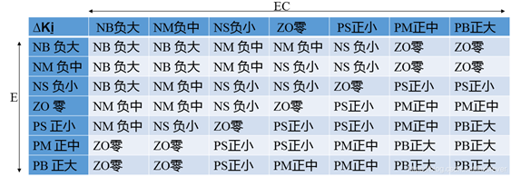

- $K_D$ 规则

  在调节初期，应加大微分作用，这样可得到较小甚至避免超调；而在中期，由于调节特性对$K_D$ 值的变化比较敏感，因此，$K_D$ 值应适当小一些并应保持固定不变；然后在调节后期，$K_D$ 值应减小，以减小被控过程的制动作用，进而补偿在调节过程初期由于 $K_D$ 值较大所造成的调节过程的时间延长。

  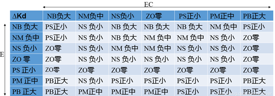

