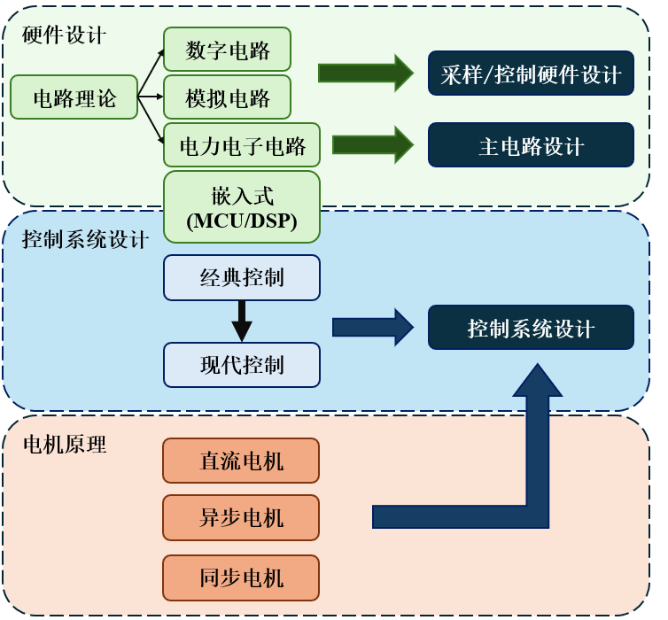

# Engine
本仓库用于记录电机驱动相关理论的学习过程，仓库内容如下：

> - `Note`：电机驱动相关笔记；
> - `Code`：电机驱动相关例程；
> - `BSP`：电机模组通信代码库；
> - `Handbook`：手册；
> - `Tool`：上位机工具；
> - `Mode`：电机驱动仿真模型和电机本体仿真模型；

---

**学习路径：**



---

**下载流程：**

由于仓库内存在一些使用 LFS 管理的软件包，使用 `git clone` 时会比较慢，因此推荐的下载流程如下：

1. 跳过 LFS 管理，`clone` 仓库本体：

   *Powershell：*

   ```shell
   $env:GIT_LFS_SKIP_SMUDGE=1; git clone --depth 1 https://github.com/SSC202/Engine.git
   ```

   *Windows CMD*：

   ```shell
   set GIT_LFS_SKIP_SMUDGE=1
   git clone --depth 1 https://github.com/SSC202/Engine.git
   ```

   此时可以正常使用仓库。

2. 如果需要下载 LFS 管理的大文件，使用以下命令 (下载用时较长)：

   ```shell
   git lfs fetch
   git lfs checkout
   ```

   
